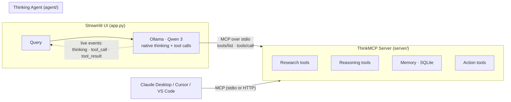

<div align="center">

# 🧠 ThinkMCP

**A local-first research agent that shows its work — built end-to-end on the Model Context Protocol.**

Qwen 3 thinks, plans, searches, self-critiques, and writes reports — entirely on your machine.
No cloud LLM. No API bill. Every thought and tool call streamed live to the screen.

[](https://github.com/Gh-Novel/ThinkMCP-Agentic-Tools/actions/workflows/ci.yml)
[](https://www.python.org/)
[](LICENSE)
[](https://modelcontextprotocol.io)
[](https://ollama.com)

</div>

<!-- ──────────────────────────────────────────────────────────────
     DEMO GIF GOES HERE — record the Streamlit UI running a query
     and save it as docs/demo.gif, then uncomment:

<p align="center">
  
</p>
─────────────────────────────────────────────────────────────── -->

---

## What it does

Ask a research question. The agent **plans** an approach, **searches** the web, ArXiv, and GitHub, **remembers** what it finds, **critiques** its own draft, and delivers a sourced answer — while the UI renders every reasoning step and tool invocation the moment it happens. Export any session as Markdown or JSON.

The same 13-tool MCP server also plugs straight into **Claude Desktop, Cursor, or VS Code**.

## Engineering highlights

These are deliberate design decisions, not defaults:

- 🔌 **The agent is a real MCP client — not a wrapper.** It spawns the server as a subprocess, discovers tools over the protocol (`tools/list`), and invokes them with `tools/call` ([agent/mcp_client.py](agent/mcp_client.py)). Zero hardcoded tool schemas; add a tool to the server and the agent picks it up automatically. This is the exact integration path Claude Desktop uses.
- 🏠 **Local-first inference.** The reasoning loop runs on Qwen 3 via Ollama ([agent/thinking_agent.py](agent/thinking_agent.py)), capturing the model's native thinking stream — with automatic fallback to parsing inline `<think>` tags for instruct-only variants. Works fully offline except optional web search.
- 📡 **True live streaming.** The agent emits events (`thinking`, `tool_call`, `tool_result`) through a callback; the Streamlit UI drains them from a thread-safe queue and renders mid-run — no waiting for completion ([app.py](app.py)).
- 💾 **Durable memory.** `remember`/`recall` are SQLite-backed ([server/tools/memory.py](server/tools/memory.py)), so findings survive restarts and are shared between the UI agent and any connected MCP host.
- 🚦 **Two transports, one server.** stdio for desktop hosts, Streamable HTTP for remote/multi-client deployments — selected at launch, not forked code.
- ✅ **Tested and linted in CI.** 31 pytest cases covering tools, agent helpers, and server registration, plus ruff — on Python 3.10 and 3.12 for every push.

## The 13 tools

| Category  | Tools | Notes |
|-----------|-------|-------|
| Research  | `web_search` · `fetch_url` · `search_papers` · `search_code` | Tavily, raw HTTP, ArXiv, GitHub |
| Reasoning | `think` · `critique` · `plan` | deterministic, instant, reproducible |
| Memory    | `remember` · `recall` · `list_memory` | persisted in SQLite |
| Actions   | `write_report` · `create_summary` · `compare` | markdown deliverables |

## Architecture



## How the agent loop works

1. Connect to the ThinkMCP server as an MCP client and discover all tools over the protocol.
2. Send the query to Qwen 3 with the discovered tool schemas and thinking enabled.
3. Capture the thinking stream → emit it to the UI as it arrives.
4. Execute each requested tool **through MCP**, feed results back to the model.
5. Repeat until the model answers (or the iteration cap trips), self-critiquing along the way.

## Quickstart

**1. Install [Ollama](https://ollama.com) and a Qwen 3 model** (any tool-capable variant):

```bash
ollama pull qwen3:8b
```

**2. Install ThinkMCP:**

```bash
git clone https://github.com/Gh-Novel/ThinkMCP-Agentic-Tools
cd ThinkMCP-Agentic-Tools
python -m venv .venv && source .venv/bin/activate
pip install -e ".[dev]"
```

**3. (Optional) keys for web/code search** — everything else needs none:

```bash
export TAVILY_API_KEY="tvly-..."   # web search — tavily.com
export GITHUB_TOKEN="ghp_..."      # optional, raises GitHub rate limits
```

**4. Run:**

```bash
streamlit run app.py
```

Opens at `http://localhost:8501` — pick your model in the sidebar (installed models are auto-detected) and run a query.

> Defaults are env-overridable: `THINKMCP_MODEL=qwen3:14b`, `OLLAMA_HOST=http://...`

## Use the server from Claude Desktop / Cursor / VS Code

**Claude Desktop** — `~/Library/Application Support/Claude/claude_desktop_config.json` (macOS) or `%APPDATA%\Claude\claude_desktop_config.json` (Windows):

```json
{
  "mcpServers": {
    "thinkmcp": {
      "command": "python",
      "args": ["/absolute/path/to/thinkmcp/server/mcp_server.py"],
      "env": {
        "TAVILY_API_KEY": "tvly-...",
        "GITHUB_TOKEN": "ghp_...",
        "THINKMCP_REPORTS_DIR": "/absolute/path/to/thinkmcp/reports"
      }
    }
  }
}
```

**Cursor** — Settings → MCP → Add MCP Server, paste the same block.
**VS Code** — add the same server (with `"type": "stdio"`) to `.vscode/mcp.json`.

Restart the host and ThinkMCP appears under connected servers.

## Remote HTTP server & Docker

```bash
# Streamable HTTP transport — MCP endpoint at http://host:8000/mcp
python -m transport.http_transport --host 0.0.0.0 --port 8000
```

```bash
docker build -t thinkmcp .

# Streamlit UI (talks to Ollama on the host machine)
docker run -p 8501:8501 \
  -e OLLAMA_HOST="http://host.docker.internal:11434" \
  -e TAVILY_API_KEY="tvly-..." \
  thinkmcp

# Or run the MCP HTTP server instead
docker run -p 8000:8000 thinkmcp \
  python -m transport.http_transport --port 8000
```

## Tests & quality

```bash
pytest          # 31 tests: tools, agent helpers, MCP server registration
ruff check .    # lint
```

Both run in [GitHub Actions](.github/workflows/ci.yml) on Python 3.10 and 3.12 for every push and PR.

## Configuration

| Env var | Default | Purpose |
|---|---|---|
| `OLLAMA_HOST` | `http://localhost:11434` | Ollama server URL |
| `THINKMCP_MODEL` | `qwen3:8b` | Default agent model |
| `THINKMCP_NUM_CTX` | `16384` | Context window for the agent loop |
| `THINKMCP_MEMORY_DB` | `./thinkmcp_memory.db` | SQLite memory location |
| `THINKMCP_REPORTS_DIR` | `./reports` | Where `write_report` saves files |
| `TAVILY_API_KEY` | — | Enables `web_search` |
| `GITHUB_TOKEN` | — | Higher rate limits for `search_code` |

## Project layout

```
thinkmcp/
├── server/
│   ├── mcp_server.py          # FastMCP server, all 13 tools registered
│   └── tools/
│       ├── research.py        # web_search, fetch_url, search_papers, search_code
│       ├── reasoning.py       # think, critique, plan
│       ├── memory.py          # remember, recall, list_memory (SQLite-backed)
│       └── actions.py         # write_report, create_summary, compare
├── agent/
│   ├── mcp_client.py          # real MCP stdio client (tools/list + tools/call)
│   └── thinking_agent.py      # Ollama (Qwen 3) agentic loop with thinking
├── transport/
│   ├── stdio_transport.py     # stdio launcher (Claude Desktop)
│   └── http_transport.py      # Streamable HTTP launcher (remote)
├── tests/                     # pytest suite
├── app.py                     # Streamlit UI with live-streaming trace
├── pyproject.toml
└── Dockerfile
```

## Design notes

- `critique` and `plan` are **deterministic heuristics by choice** — instant, free, and reproducible. The LLM does the reasoning; these tools provide structure and a self-check ritual without burning tokens or adding nondeterminism.
- Thinking capture degrades gracefully: native thinking stream when the model supports it, inline `<think>`-tag parsing when it doesn't.

## Roadmap

- [ ] Benchmark: answer quality with vs. without the reasoning tools on a fixed question set
- [ ] LLM-judged critique mode (local, via Ollama) as an opt-in alternative to heuristics
- [ ] Semantic memory recall (embeddings over the SQLite store)
- [ ] One-command hosted demo

## License

[MIT](LICENSE)
